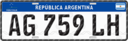
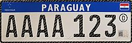
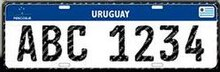
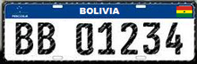

# Atividade - Unidade I

## Resumo da História
As placas de identificação de veículos do Mercosul (oficialmente: **Placa Mercosul**) são um sistema em implantação de cadastro de veículos do transporte rodoviário em países do Mercado Comum do Sul (MERCOSUL), bloco regional e organização intergovernamental fundado em 1991.
A resolução para unificação dos modelos das placas aconteceu em 15 de dezembro de 2010 com os então membros do Mercosul: Argentina, Brasil, Paraguai e Uruguai.
O design básico foi obra de um argentino, Nelson Sarmiento. No entanto, embora inicialmente se pretendesse uma base alfanumérica única para todos os países do bloco, cada país acabou por adotar um formato próprio, de modo a garantir o controle sobre sua própria base de cadastro de veículos.

### Características comuns:
* Arranjo: sete caracteres;
* Bandeira do Estado-membro: a bandeira de cada país na parte direita da faixa azul, com arestas arredondadas;
* Dimensões: 400mm x 130mm para automóveis em geral / 200mm x 170mm para motocicletas;
* Emblema do bloco: o emblema do Mercosul/Mercosur na parte esquerda da faixa azul;
* Faixa azul: a parte superior das placas conterá uma faixa na cor azul, com largura de 30mm;
* Fonte tipográfica: FE Engschrift.

### Exemplos de Placas

*Figura 1 - Exemplo de Placa da Argentina*

*Figura 2 - Exemplo de Placa do Brasil*

*Figura 3 - Exemplo de Placa do Paraguai*

*Figura 4 - Exemplo de Placa do Uruguai*

*Figura 5 - Exemplo de Placa da Bolivia*

## Problema:
Desde 27 de novembro de 2014 o CONATRAN estabeleceu como novo padrão oficial de *Placa de Identificação Veicular* ou *PIV* o sistema alfanumérico composto por quatro letras e três números, no formato **ABC1D23**, como mostra a Figura 1, também conhecido como *Padrão Mercosul*, por seguir a diretiva e ostentar o emblema do bloco econômico, conforme as regras da Resolução 780 de 2019. O novo padrão substitui o anterior, não mais emitido, mas ainda válido, com três letras e quatro números, no formato ABC·1234, que iniciou-se em 1990 e que seguia a Resolução 231 de 2007 do Denatran. Desta forma, a Startup quer que organize uma certa quantidades de placas que são coletadas e armazenadas através de um sistema de visão computacional. Essa organização deve ser feita lexicograficamente.

*Figura 6 - Exemplo de ordenação lexicográfica de uma sequencia de cadeias de caracteres.*

## Solução:

Para solucionar o problema proposto pela *startup*, após o ínicio do desenvolvimento de uma aplicação para monitorar o tráfego de veículos em várias cidades da América Latina, foi necessário utilizar um algoritmo cuja complexidade seja menor que `O(n.log(n))`, ou seja, que fosse ainda mais eficiente (`O(n^2)` é incogitável devido a quantidade de n).

Para atender esse critério o método que será utilizado será o **Radix Sort**. Esse algoritmo de ordenação é rápido e estável que pode ser utilizado para ordenar itens que estão identificados por *chaves únicas*, ordenando em qualquer ordem relacionada com a **lexografia**. Um outro motivo para a escolha desse método é que ele é utilizado quando o que vai ser ordenado são números inteiros de comprimento máximo constante, isto é, independente de n. As placas em si tem uma quantidade constante de caracteres, 7 ao todo, sendo 4 letras e 3 números.

O funcionamento do Radix Sort se baseia em uma ordenação dígito a dígito, do dígito menos significativo para o mais signficativo. Utiliza um ordenador estável como método auxiliar que no caso será o Counting Sort. Esse método de ordenação auxiliar é estável devido ao fato de se preservar a ordem relativa de itens com valores idênticos, ou seja, números com o mesmo valor aparecem no arranjo de saída na mesma ordem em que aparecem no arranjo de entrada.[^1]

Como o Radix Sort é de complexidade `O(d(n + k))`[^1] onde d=7 (número de caracteres por placa) e o k=36 (número de possíveis caracteres), como k e d são números bem pequenos então podemos afirmar que esse método é `O(n)`. Desta forma a complexidade vai depender do método de ordenação auxiliar, nesse caso será o Counting Sort, que é `O(n + k)` [^2], portanto, como k ∈ O(n), ele tem complexidade `O(n)`, com isso a complexidade geral dessa ordenação também será `O(n)`, cumprindo assim o objetivo de usar uma ordenação com complexidade menor que `O(n.log(n))`.

# Referências Bibliográficas:

[1]     Diário Oficial da União. **"RESOLUÇÃO Nº 780, DE 26 DE JUNHO DE 2019"**. Disponível em : https://www.in.gov.br/web/dou/-/resolucao-n-780-de-26-de-junho-de-2019-179414765

[2]     Wikipedia. **Placas de identificação de veículos no Mercosul**. https://pt.wikipedia.org/wiki/Placas_de_identifica%C3%A7%C3%A3o_de_ve%C3%ADculos_no_Mercosul

[3]     N. Satish, M. Harris, and M. Garland. **Designing efficient sorting algorithms for manycore GPUs**. NVIDIA Technical Report NVR-2008-001, September 2008. Disponível em: https://mgarland.org/files/papers/nvr-2008-001.pdf

[4]     Matt Cone, **Markdown Cheat Sheet - A quick reference to the Markdown syntax**. Disponível em: https://www.markdownguide.org/cheat-sheet/

[5] https://www.each.usp.br/digiampietri/SIN5013/11-tempoLinear_RadixSort.pdf

[6] https://www.youtube.com/watch?v=zzjEhqwvQZI&t=1999s

[7] https://www.youtube.com/watch?v=Lb_1R6JGD6o&t=2085s

[8] https://ww2.inf.ufg.br/~hebert/disc/aed1/AED1_05_ordenacao2.pdf

[9] Cormen,T.H., Leiserson,C.E., Rivest,R.L., Stein,C. **Algoritmos – Teoria e Prática**. Editora Campus. 3a Edição, 2012.. 

## Referente ao ***Livro Cormen*** [9] 

[^1]: (Capítulo 8 - Páginas 170 a 172 - Radix Sort)
[^2]: (Capítulo 8 - Páginas 168 a 170 - Counting Sort)
